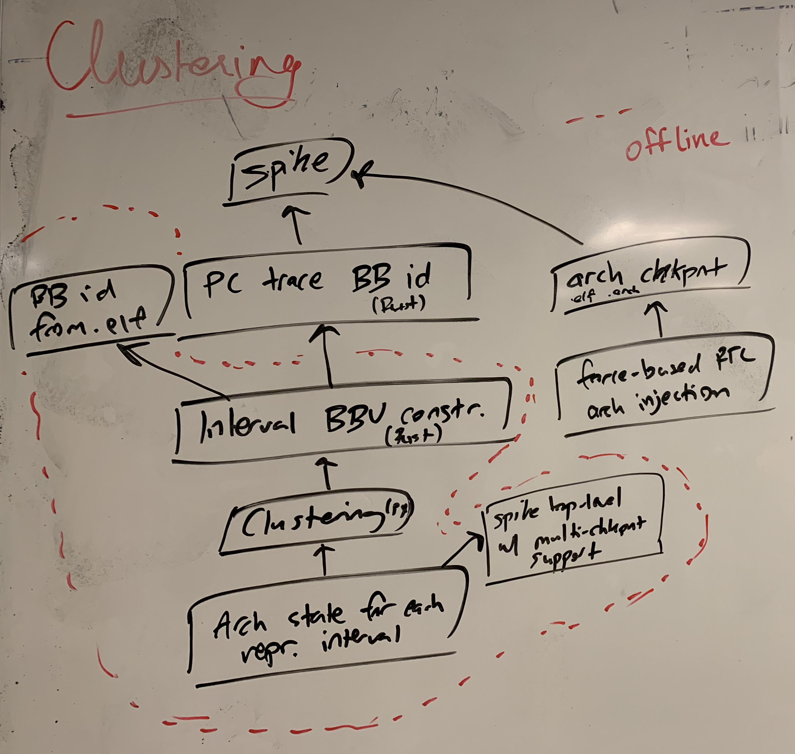

# Multi-Level Simulation

- ISA simulation -> uArch trace-based models -> RTL simulation
- Old title: `gem5 Hacking, RTL <-> gem5 Correlation, uArch State Transfer`
- [Original proposal to Google](https://docs.google.com/document/d/1ZIl1rExD4e5BkUvhTFgKjWBVJPtYICGU_o3SSJVmypI/edit?usp=sharing)
- [CS294 project proposal](https://docs.google.com/presentation/d/1tmzARnBtCjhgbhEOnKEhFlAWSjmPCOcvpWcT3EGXO6U/edit?usp=sharing)

## External Meetings

### 3/5/2024 (Intel)

Thanks for the feedback too! I've summarized the points below:

- The cost of bespoke microarchitectural simulators and emulators isn't merely in the hardware cost. Bespoke models require a lot of human work to maintain and keep correlated with the RTL/silicon.
- Microarchitectural models have the ability to produce collateral that's difficult to produce in RTL simulation. For example, easy visualization/implementation of bottleneck analysis and more critically what-if analysis. Concretely, if we wanted to model a cache with infinite associativity or a particular latency or a memory bus with unlimited bandwidth, this is difficult to do in RTL simulation. While we can integrate performance models for specific SoC components in software with RTL simulation, it might be hard to model these 'oracle' components that are useful to identify bottlenecks and establish upper bounds on performance.
- The features we want from a functional simulator are a clean separation of architectural state from the state advancement API. We want the ability to modify the perceived time seen by the functional simulator and finely control its advancement. We want to be able to take comprehensive, full architectural state snapshots.
- The features we want on the RTL side is a way to automatically generate an injection testharness given RTL-level annotations of architectural state. This becomes difficult when there are many microarchitectural states that map to the same architectural state. We would need a way to go from a RTL-level function that describes the uArch -> arch state mapping to a concrete way to perform injection. Having a way to enumerate all the uArch states that map to the same arch state may also be valuable for verification.

### 1/22/2024 (ATHLETE)

- add industry uarch simulator as a row in the comparison table
- need to correlate functional warmup model + time decorrelation from RTL - these are sources of errors
- invariant synthesis is very interesting - anomaly detection is very good - keep working on this
    - trying to get something that fails to show up again and again is valuable - apple knows this intrinsically, don't need to convince them
- what are the sources of errors in your graphs? why does one benchmark perform a lot better than the other one? I said this is due to cache locality being greater in some workloads
- how does error scale as your change the interval lengths? what length is optimal? what feedback do designers really want?
- can we find a good error estimate heuristic? how does your distance from centroid error metric work? can you formalize this?

## Internal Meetings

### 3/5/2024

- Vighnesh
  - Nothing much to report, gave 2 presentations (Apple, Intel)
  - uArch perf models give ability to do oracle modeling of various SoC components
- Raghav
  - Also busy, not enough time to work on engineering
- Dhruv
  - Coremark with functional warmup trace
  - Figure out why coremark with fn warmup looks weird - why does it seem to have less variation in the golden trace too?
  - As time permits, let me know, then move various functions for plotting and data analysis from the notebook to the tidalsim library
- Charles
  - Looked at RTL nodes for blocking L1 HellaCache
  - Blocking cache has a PerfEvents annotation - can tell you if the cache is blocking or not
  - There are also some internal signals we can pick out (also ones that drive the PerfEvent IO)

### 2/27/2024

- Vighnesh
  - Still unsure about DRAMSim2 warning messages (will have to look at waveforms)
  - Worked on some cleanup of the codebase + testing some extrapolation functions
  - Nothing much to report other than that
- The IBM Power10 tracepoint sampling system
- Continue investigation on variable length intervals
- gem5, gem5 (sampled), TidalSim, FireSim (golden reference)
  - Backend: gem5 vs RTL, methodology: full vs sampled
  - Workload: SPEC
  - uArch param: L1/L2 cache size split ratio
  - Baseline config: TidalSim/FireSim (Base Rocket config), gem5 (???)
  - Sensitivity analysis / error analysis
- RTL simulation is important
  - With growing SOC complexity, FireSim / RTL sim becomes difficult
  - We should tackle this - it has very large costs in FPGAs/compute requirements
  - How to deliver sustainable RTL simulation performance into the future
  - FPGA emulation infra scaling doesn't match the SoC complexity scaling
  - We want to capture RTL fidelity situations in the SoC without these massive compute requirements
- Specify the milestones to achieve this final vision
- gem5 vs RTL: Jason is interested, we need him to drive this

### 2/20/2024

- Vighnesh
    - Construct cache checkpoints for every arch checkpoint with data from mem.bin dump
    - Modified the injection testharness to inject L1d cache (data+tag array) state from a checkpoint directory
    - I can run some embench benchmarks with cache functional warmup
    - I fixed the Rocket config so that it is L1 only (no L2)
        - For some embench benchmarks (e.g. huffbench), DRAMSim2 reports unaligned accesses from the L1 cache
        - ??? unsure why
        - seems related to eviction
    - Cache model right now marks all cache lines that are resident as dirty
        - But some lines ought to be marked as read-only (since there is a lot of static data in these benchmarks)
        - Affecting eviction scheme, causing necessary write-backs
        - Very minor issue for these embench workloads (they all fit in L1 + a little extra cache room)
    - WIP: some cleanup and data analysis fixes
    - Next: figure out these DRAMSim2 warning messages (64B unaligned accesses from L1)
        - Analyze the state diff between injection waveform and full RTL sim waveform
- Raghav
    - Working on more metric extraction from the spike trace for binary-agnostic embedding
- Dhruv
    - Finished running coremark
    - Had to increase cycle timeout for golden sim case (200M, but it took 95M cycles) (add this as CLI parameter)
        - Have some kind of heartbeat from the RTL sim testharness indicating whether the cycle count is advancing
        - side channel to collect cycles/real second for simulation throughput
    - Patch ISA string (push to tidalsim)
    - Looks roughly correlated
    - Try cache warmup flow on this
    - Pull out notebook logic for plotting and data analysis into library
    - Do some investigation into zstd baremetal compile
        - we might be able to use libgloss malloc/sbrk...
    - also investigate lz4 repo (may be more amenable to baremetal compile)
- Charles
    - Extract L1 hit/miss ratio from RTL simulation

### 2/13/2024

- Vighnesh
  - Can do MTR construction from spike trace
    - You can't get data for entire cache line from single mem access
    - Fill out which cache line is resident during reconstruction
    - Insert actual data during arch checkpointing using mem commands
      - Overhead + complexity

- Raghav
  - Finish up Markov/PPM predictability stat collection
  - ILP - sliding window with independent instructions (no RAW dependencies)

- Charles
  - Looked at correlation(?) stuff
    - removing prints corrects FireSim/RTL Sim correlation
  - Started looking at counting L1$ misses
    - Look at HellaCache IOs and look at hit v misses
      - Eventually event tracking API using TinyChisel from Jerry + Co

### 2/6/2024

- Vighnesh
    - Can generate files for every dcache tag and data RAM in the RTL
    - Pipecleaning injection example works, can now inject 2d regs directly without looping (improves simulator compilation time significantly)
    - Have generic cache model API + dumping code
    - Rewriting the spike log parsing to handle both typical log format + full commit log
    - Integrating these changes into MTR code
- Charles
    - Comparing embench workloads + coremark across Firesim metasim and RTL sim
    - Difference in dynamic instruction count between these two in Coremark
        - Appears to come from memory allocation - further investigation needed
        - One potential is any HTIF syscall proxying
        - 20k insts out of 35M total instructions
    - Difference in cycle count is pretty similar (less than 1% difference)
    - WIP: metric extraction in testharness for MPKI and cache misses
- Dhruv
    - Coremark cross-compilation on RISCV (Charles has this working with ucb-bar/coremark-workload with latest bumped riscv-coremark)

### 1/30/2024

- Vighnesh
    - Cleaned up dcache pipelining data generation + injection files
    - Figured out the dcache data array organization in RTL + injection strategy
    - Working on generating files for every RAM
- Raghav
    - Looking at prior work to see what they did to produce binary-agnostic interval embeddings
    - Instruction mix (split of arith/branch/jump/stores/loads)
    - Microarchitectural features (TLB accesses, branch misprediction estimates, i/d caches estimates, amount of ILP)
- Dhruv
    - HyperCompressBench seems to produce a bunch of files to be compressed/decompressed - sure that makes sense
    - facebook/zstd can be compiled using riscv gcc baremetal toolchain, but only the static library (not the dynamic library)
    - We want to produce a C top that includes a file to be compressed/decompressed in the static segment of the binary and then statically links the zstd static library to perform the roundtrip, and performs a comparison to check for equality (we can leave this part out)
    - Then this whole thing should work baremetal without any syscall proxying necessary (I hope)
    - Hints:
        - https://github.com/ucb-bar/chipyard/blob/main/tests/Makefile (libgloss usage example)
        - Let's use LZ4 first rather than zstd (https://github.com/lz4/lz4) - we want to use simple C code (not C++) and something that only uses the most basic syscalls (and never has to use host proxied syscalls)
        - https://github.com/ucb-bar/libgloss-htif (there are notes about using the linker scripts here in the README)
        - There is a way to embed random files in C programs (https://codeplea.com/embedding-files-in-c-programs)
    - Coremark is a better starting point
        - https://github.com/riscv-boom/riscv-coremark/commit/6e1d72b864e45f67031ffaedb0b01b5d030d6d3c

### Jan 2024 (SLICE Retreat) Feedback

??? - pending both Vighnesh and Raghav

### 1/23/2024 (Start of Sp24 Semester)

- Task priority list
    - Functional warmup of L1d + L1i
    - Switching to robust spike checkpointing fork
    - Evaluation on other workloads
        - Dhrystone, coremark
        - HyperCompressBench (if baremetal is possible)
    - Microarch event API for Chisel + Rocket points
        - use for perf metric extraction
    - arch/uArch state marking API for Chisel + Rocket points
        - use for testharness generation via FIRRTL pass
        - this can proceed independently of the robust spike checkpointing
    - better interval embeddings
        - instruction mix, # of functions called, ..., uArch features
    - race to Linux boot
        - requires reference IPC trace from FireSim (requires above uarch event API)
        - requires robust checkpointing (or else we will definetely be making mistakes)
        - requires testharness generation (or else we will also make mistakes)
        - requires correlation of RTL sim enviroment + FireSim

- Vighnesh
    - Functional warmup for L1d + L1i
    - Quantify error related to functional/detailed warmup
        - Lumped error of functional/detailed warmup
        - Want to decorrelate these
        - Use entire interval for perf metric extraction - do detailed warmup using the history
    - Quantify error related to clustering by sweeping n_clusters and looking for fall off points
    - Generate IPC plots for all embench benchmarks and look at them manually (for dynamic instruction count mismatch)
    - Write down retreat feedback
- Raghav
    - Investigate prior work in interval embeddings
    - Implement and evaluate on tidalsim embedding
    - Write down retreat feedback
- Dhruv
    - Evaluating other workloads
    - HyperCompressBench baremetal riscv compilation
- Charles
    - Correlate RTL sim and FireSim on baremetal workloads (hello, embench)
        - Just use metasim for now
    - Dynamic instruction count should be the same
    - IPC traces should contain some offset (due to DRAM timing model configuration mismatch)

### 12/8/2023

- Vighnesh
    - Fixed spike checkpointing issue, that was hard actually
        - problem 1: in spike interactive mode the htif tohost polling loop runs every commited instruction vs every 5000 instructions in normal mode
        - problem 2: if a checkpoint is supposed to be captured when the program has written syscall_exit to tohost, then the simulation terminates immediately and the checkpoint isn't captured
    - Both problems were fixed - the first one by modifying interactive.cc and the second one by adding a new HTIF argument +suppress-exit
    - Did some more data analysis, determined a very weak correlation between IPC error and distance from centroid
        - Expect correlation to get stronger after functional warmup
- Raghav
    - Cache warmup
    - Zesto cache model as the base
    - Need a replacement policy similar to Rocket L1 - is it random (LFSR) or pseudo-LRU?
      - It is random, see `DCacheParams` in `generators/rocket-chip/src/main/scala/rocket/HellaCache.scala`
- Charles
    - If clusters isn't specified as input to the script, then infer the 'right' number of clusters
    - If time: multiple checkpoints per cluster

### 12/1/2023

- Vighnesh
    - Refactored tidalsim scripting infra to work with dataframe rather than ad-hoc matrices
    - Fixed a few bugs along the way, and some bugs related to the refactor
    - Some issue in spike checkpointing when capturing >= 16 checkpoints in a run
    > AssertionError: different number of lines per loadarch! something is wrong.
    - I will fix this
    - Plot: IPC error %, distance (z-score) of interval embedding from its centroid
    - Dcache:
        - No valid bits
        - Tag / data array
        - The # of address bits doesn't match what I expect
        - Reported that a cache block is 64B, however in RTL, 32B ???
- Raghav
    - Fixing up Verilator support for state injection testharness
    - Discovery of a new discrepancy between loadarch and RTL arch state
        - FPR in Rocket is stored in recoded format, not IEEE
        - We need to do some translation before state injection
        - softfloat has a function to do the recoding and backwards translation for us, just have to hook it in
    - Next: dcache model based on spike memory trace parsing
- Dhruv
    - Making sure the gen-ckpt/tidalsim script works as-is on his setup
- Charles
    - Make sure you can run the scripts as expected

### 11/29/23

- Raghav
  - ELF-based BB extraction has been integrated
    - Use `tidalsim -e`
  - Comparison against Ghidra in `elf_basic_block_id.md`
  - aha-mont64 gives the same embedding with either approach
  - Working on Verilator support

### 11/21/2023

- Vighnesh
    - Didn't do anything, nothing to report
    - One major thing is now my quals/thesis will be focused on multi level sim, so I will dedicate 80% of my time to this
    - Read a bit of the MTR paper
    - Added a few more tasks
- Raghav
    - Diff of Ghidra vs our elf BB extraction to make it easier to evaluate where differences are coming from

### 11/17/2023

- Vighnesh
    - Perf metrics are instruction-based now
    - More refactoring
    - Rewrite of the BBV embedding + tests
    - Tidalsim top-level is 'done' for the MVP
    - embench aha-mont64: ~5-10 minutes in RTL sim (depending on debug mode), 10-15 seconds for sampled simulation version
    - gem5 simpoint algorithm for BBV embedding - don't bother trying to replicate their thing just yet, but if perf becomes an issue we can reach for it, and maybe consider the issues related to inaccurate basic block assignment (if basic block are split later in a program execution)
- Dhruv
    - Pipecleaning the flow to make sure it works
- Vighnesh TODO: Functional cache warmup strategy
    - Leverage memory trace from spike
    - Use MTR to analyze it and extract cache uArch states for each checkpoint
- Further data analysis
- Dhruv TODO
    - Try other benchmarks, make sure they work fine, analyze their errors
    - Integrate PCA-based n-clusters selection into the tidalsim script
- Raghav TODO
    - Complete the elf based BB extraction and integrate it with a commandline flag in tidalsim
    - Pick something off the task list

### 11/10/2023

- Vighnesh
    - New `gen-ckpt` script - works the same as the old `generate-ckpt.sh`, but it's in Python inside `tidalsim`
    - The script + spike have also been modified to take multiple checkpoint instruction points and dump them all in the same spike run
    - Some *validation* of state reloading in RTL sim by sweeping many checkpoint positions, injecting them into RTL sim, and verifying the program terminates cleanly
    - Perf metric extraction
        - It works, BUT
        - right now I specify the window in terms of cycles
        - BUT, I think it should be specified in terms of instructions
            - Instructions are constant for tidalsim vs pure RTL sim, but cycles isn't
    - Refactoring
        - tidalsim is now just a python poetry project, pytest, mypy
    - Added tests, rewrote some of the PC/spike log based BB extraction stuff
    - Typechecking and some small fixes there
    - Working on top-level script - all the pieces are in place to make this script now
    - TODO:
        - Proper validation of each checkpoint by comparing arch state between spike and RTL sim at the end of a given checkpoint + N instructions
        - Fix up the sampling window stuff to be in terms of instructions vs cycles
- Raghav
    - Wrote initial version of asmdump parser to BB extraction, comparing against Ghidra produced BB extraction
    - `jal` discrepancy - if a jal target is only called from a single position, then the `jal` isn't considered a terminating point of the basic block
        - e.g. the function call can be inlined
        - this is an acceptable discrepancy - it won't affect the basic block embedding
    - `sext.w` / `c.addiw` discrepancy - Ghidra considers these control instructions when they are not
        - ~~Ah, seems to be a result of Ghidra decoding instructions using rv32 encoding rather than rv64~~
        - ~~Ghidra seems to recognize that the elf is rv64gc, but there is probably an internal bug in which disassembler it uses~~
        - nvm, there's no discrepancy, basic blocks were being terminated because of a branch/jump target at the following instruction
    - TODO: Porting your script to the repo, unifying the data structures used as output
    - Ghidra found 675 basic blocks, Raghav's script found 770 basic blocks

### 11/3/2023

- Vighnesh
    - RTL arch state injection works - `hello` runs clean
    - Current thing to do:
        - Reimplementing the `generate-ckpt.sh` script (calls spike, dumps checkpoint, post-processing of memory binary file)
        - Ability to take multiple checkpoints in the same spike run
    - Code:
        - Chipyard `multi-level-sim` branch: https://github.com/ucb-bar/chipyard/tree/multi-level-sim
        - testchipip `loadarch-dpi` branch: https://github.com/ucb-bar/testchipip/tree/loadarch-dpi
        - `dump_spike_checkpoint` script in tidalsim: https://github.com/euphoric-hardware/tidalsim
- Dhruv
    - Some results for clustering and identifying ideal clusters depending on instruction interval length
    - Next:
        - Correlate the clusters back to basic blocks and sanity check them
        - Compare your BB id results against static binary analysis technique
- Raghav
    - Doing static binary analysis, using Ghidra as a reference for basic block identification for RISC-V binaries
    - Writing another binary analysis program using output of asmdump
        - Identify control flow insts + targets
        - Iteratively split program into basic blocks as control flow instructions are identified statically
    - Will compare against Ghidra and the spike PC trace based basic block extraction
    - ~20-25 dynamic jumps in `hello`, still unclear if this actually matters for the actual final metric
- Charles
    - Pipeclean the rivet spike model to get out uArch state for BP/cache
    - Correlation of cache state in spike model to RTL state in Rocket

### 10/30/2023

- Vighnesh
    - Arch state injection appears to work for ISA tests
    - Hangs for `hello.riscv` - debug pending
    - Some suspected fishy stuff was identified
- Next things to work on
    1. Debug hello restore
    2. Add checks that dump arch state at end of RTL simulation to compare to spike
    3. Perf metric extraction via hierarchical peeks of the riscv trace port

### 10/27/2023

- Vighnesh
    - Verified that PC injection works
    - Extracted loadarch parsing logic into separate compilation unit in testchipip
    - Added DPI wrapper for loadarch file parsing and integrated with custom TestDriver top
    - Validated that existing loadarch w/ DTM still works fine
    - Currently trying to add all the forces to get injection working in RTL sim
    - Almost working arch state injection in RTL sim
    - Next steps:
        - IPC extraction via side channel and X-cycle sampling window
- Raghav
    - Using gcc to compile baremetal programs with DWARF4
    - Able to load binaries into Ghidra to dump basic blocks as reference
    - Next step: write a custom script to parse the asmdump and do basic block extraction
    - Talk to Jerry/Tianrui to see what they are doing
    - Write a script to parse Ghidra output and correlate it with Dhruv's script output
    - Forward looking: knowing which intervals for which we want arch snapshots, write either spike custom top or just modify spike to take those snapshots and dump them to disk
        - Combine it with my RTL state injection to get perf numbers for each interval
        - Extrapolate to the entire trace
        - Initial error calculation (with zero warmup) vs pure RTL simulation
- Dhruv
    - BBV construction for intervals of size 100-900 on aha-mont64
    - PCA analysis - we find that for intervals of size 900, there are about ~200 significant singular values (rank ~ 200)
    - Next steps: unify the data structures used by the elf BB extraction and PC trace BB extraction and PC trace -> BBV interval embedding construction
        - Evaluate alternative embedding algorithms
        - Evaluate different interval sizes
- First goal is ultra naive multi level sim
    - BB extraction (from .elf or spike trace) (@raghav, @dhruv)
    - Interval embedding (using PC trace) (@'')
    - Clustering and dim reduction (@'')
    - Interval selection (@'')
    - Arch checkpoint extraction for each interval start (@vighnesh)
    - Injection of each checkpoint into RTL simulation (@vighnesh)
    - Perf metric extraction (@vighnesh)
    - Perf extrapolation (@???)
- Compare vs pure RTL sim and same perf extraction technique
    - Use the same TestDriver-inject.v
    - But with an empty loadarch file and the full binary as is (using Chipyard SoC bootrom)

### 10/18/2023

- Vighnesh can't reproduce DMI load arch segfault
  - might be an issue with using pk
    - Sim DRAM alloc wrong size
- Vighnesh worked on state injection
  - Can change Rocket PC at start of sim via force stmt as long as we use fast loadmem and disable mcip interrupt
  - Will continue on this more
- Raghav worked on BB ID
  - 5 approaches, 2 need source, 1 needs disassembly, 2 need binary => investigate
- Dhruv looked at SimPoint and LiveSim (basically SMARTS under-the-hood)
  - Use our own Phase Analysis, well definitely not LiveSim
- Let's ask Jerry about 100 inst PC Trace to Basic Block extraction program from gem5
- Enumerate approaches to interval embedding
  - SimPoint BBFV
    - BBFV loses information about order of basic block ordering
  - LiveSim Sampling + perf numbers of baseline

### 10/10/2023

- Discussed and assigned tasks
- Use spike as a library to control spike execution v. modifying top-level spike
  - separation of concerns
- Task Dependency Tree
  

### 10/10/2023

- [ ] Verify that coremark and embench baremetal binaries run on spike unmodified
- [ ] Investigate why hello.riscv baremetal test segfaults when spike checkpoint loaded in RTL sim
- [ ] Modify the Python script to do the following
    - [ ] Extract all the basic blocks from the PC trace alone
        - On a second pass, I should be able to give the data structure a PC and it should return the basic block ID
        - Basic blocks should be non-overlapping
        - You can use an interval tree or just a sorted data structure for ranges (where you can assume that the ranges are exclusive)
    - [ ] Compute the basic block vector for every interval by re-traversing the commit log
        - For each PC, figure out which BB it is in, then add one to that column in the vector
    - [ ] Dump BBVs for each interval and attempt clustering

### 10/6/2023, CS294 Project Proposal Discussion with Sagar/Krste

- When changing uArch parameters, the state is hard to map from the uArch model to state in RTL sim
    - Krste suggests using a more abstract model rather than a concrete uArch model so it is easy to convert from trace data to uArch state for a given parameterization
        - See "Memory Timestamp Record" (K.C. Barr, H. Pan, M. Zhang, K. Asanovic, Accelerating Multiprocessor Simulation with a Memory Timestamp Record)
        - For branch predictor functional warmup, capture the branch traces and replay them on a branch predictor model
- This technique is hard to make work for multithreaded workloads on multicore systems
    - Thread synchronization, locks/etc are dependent on the speed of execution of each core
- For each major uArch block that needs functional warmup, come up with a story of how to support them across SoCs
    - Pick a particular block to focus on this semester, but don't only solve a narrow problem (e.g. cache warmup)
    - Try to generalize the technique that you would apply for any given uArch block with long-lived state
    - Try to look at a tougher uArch block than caches (but caches are the most impactful wrt functional warmup fidelity)
    - Sagar: RTL prefetchers aren't too complicated (for what we have), creating a uArch model for them seems reasonable
- For the case study
    - Analyze cache capacity splits between L1i/L1d and also investigate the balance of 2-level cache hierarchies on our RTL
    - Try to answer the question of optimiality between unified vs separate I/D L2 caches on long workloads
    - Look at Tycho (Toicho) and other predecessor work on simulating caches with different parameterizations simultaneouly
- On benchmarks
    - Don't use SPEC
    - Try graph benchmarks ([GAP benchmark suite](http://gap.cs.berkeley.edu/benchmark.html))
    - Try hyperprotobench (can run under pk, protobuf doesn't actually use pthreads, can compile with linux gcc)
        - It should be instruction fetch bound, can model icache pressure effects
    - Think about relative errors to the number of memory accesses, cache misses
- For the practical considerations
    - Raghav: Intervals in simpoint are still around 1M cycles long!
    - Vighnesh: We can't execute an entire interval in RTL sim, we will have to sample even within that interval
- Figure out split between two of us for tasks and how to rope in outside contributors

### 10/3/2023

- Use Chipyard embench build script flags https://github.com/ucb-bar/chipyard/blob/adebd634b4075473b735a355dd010dc8fef8d6c2/software/embench/build.sh
    - To build baremetal embench binaries
    - Then the spike checkpointing flow into RTL simulation should work fine
    - Still worth figuring out how to make pk simulations reloadable into RTL simulation
- Worth checking if the coremark software (https://github.com/ucb-bar/chipyard/tree/main/software) can still be built baremetal - that should be another good target
- Next immediate todos: build both embench and coremark for baremetal, run them on spike and RTL sim, run spike checkpoint and RTL reload flow and make sure they work
    - Next: run the commit logs on your program fragment segmentation script, check the results
    - Next: actually figure out sampling points and build a spike top-level that can dump arch state from those points

### 9/26/2023

- High priority: fix the memif write issue when loading elf checkpoint into RTL simulation
    - We think this is caused by the underlying array not being large enough to hold the mem.elf file contents (2 GiB)
    - TODO: run valgrind on the RTL simulation binary and send stack trace on Slack
    - We should be able to fix this easily enough
- In the meantime: take https://github.com/riscv-software-src/riscv-tests/tree/master/benchmarks
    - Pipeclean arch checkpointing flow from spike and reload into RTL sim using these baremetal benchmarks (don't require pk)
- Once that works, the next step is to determine which PCs (i.e. inst retirement count) need their state dumped
    - Once that basic script works, then we can create a spike top-level that actually programmatically does this
    - This can be written in C++

> Could you point me to the spike branch/fork/docs about using spike as a library. I have an undergrad trying to use AFL to fuzz spike and it would be nice to have spike compiled to a static library with headers
>
> > This works (and is regressed on) in spike/master. There are no docs for the API, but there is a very simple example here https://github.com/riscv-software-src/riscv-isa-sim/blob/master/ci-tests/test-spike showing how to link against  spike and run it.For single-stepping spike-modeled harts, this https://github.com/ucb-bar/chipyard/blob/main/generators/chipyard/src/main/resources/csrc/cospike.cc is probably the best example. Basically you construct an instance of sim_t with the system configuration, and then call sim_t->get_core[hartid]->step() to single-step it.The spike source is pretty readable

- Example of using spike as a library and single-stepping a hart: https://github.com/ucb-bar/chipyard/blob/main/generators/chipyard/src/main/resources/csrc/spiketile.cc

### 9/19/2023

- Basic block extraction script using PC analysis
    - Currently working: extraction of full trace segmented by blocks
    - Clean up this code
- Pipeclean injection of arch state from spike into RTL sim and run for X number of instructions
    - https://chipyard.readthedocs.io/en/stable/Simulation/Software-RTL-Simulation.html#verilator-open-source
    - Commit log with cycle counts (we already have that from RTL sim) - gives us IPC
    - Add feature to stop simulation after X instructions
        - One possibility is to modify the spike checkpoint to inject a tohost_exit right at the basic block boundary
        - Change the testharness that prints out the commit log messages (right now the testharness hooks into a trace port at the top-level of the chipyard SoC, so we can just monitor trace port for number of commited instructions)
- Spike cache model (or standalone cache model)
- Sketch out how we want to inject spike cache state into RTL simulation
    - We need to manually correlate state for now
    - Let's just get some manual force-ing via the testharness working first
    - Figure out: where is the testharness generated from and how can we modify it?

### 9/5/2023

- Attempting to build gem5 full system simulator
    - https://gem5.googlesource.com/public/gem5-resources/+/HEAD/src/riscv-fs/README.md
    - These instructions are clearly quite stale, they suggest building the riscv glibc cross compiler from source when that has been unnecessary for a long time, fetch the toolchain from here instead
        - https://github.com/riscv-collab/riscv-gnu-toolchain/releases/download/2023.07.07/riscv64-glibc-ubuntu-20.04-gcc-nightly-2023.07.07-nightly.tar.gz
- A lot more investigation is required - it looks like in fs mode, gem5 requires that the user give a big memory blob that it will begin executing (normally linux kernel with bbl) and a disk image it will use for mocking the contents of disk
    - So if we want to get a very basic `spike pk <binary>` equivalent working, we will need to actually bundle bbl with pk with the binary to execute. Or modify `pk` to fetch the binary from a disk image and then begin executing.
    - First question - can we get pk to execute a binary from a disk image (and not using host tether)?
- Talk to Jerry about this - I have very little clue

- Another thread of work: spike execution fragment extraction via basic block coverage
    - Use spike in "library" mode (using spike like an API)
    - Programmatically interact with spike and extract the PC trace
    - Dynamically analyze the PC trace as its coming in and figure out which basic blocks are executing
    - As a first pass, dump the spike commit log (using `-l`), read that log from Python, parse out the PCs, and segment the instructions into basic blocks that are identified by their PC
        - To validate the results, just look at an asmdump and the labels and make sure they match

### 8/29/2023

- gem5 checkpointing in system emulation mode (does it work?) (what schema does the checkpoint have?)
- Can we translate the spike loadarch checkpoint + mem.elf into the gem5 checkpoint schema?
- If that doesn't work, we can add a small init section to the mem.elf that loads all the arch state manually
    - There may be a blocker here, ask Jerry, maybe this is why we use DMI to load arch state in RTL simulation
- Try building a workload with FireMarshal (https://firemarshal.readthedocs.io/en/latest/)
    - Ideally we will avoid using the gem5 linux build infra
- Investigate whether we can use the RISC-V full system mode in gem5 and use pk similar to how we use it with spike

### 8/22/2023

- [ ] Re-verify that we can compile embench baremetal rv64 and run the benchmarks on gem5 (user-space mode) and spike (with pk)
- Building embench for rv64

```patch
diff --git a/config/riscv32/boards/rv32wallyverilog/board.cfg b/config/riscv32/boards/rv32wallyverilog/board.cfg
index 2103087..d93e364 100644
--- a/config/riscv32/boards/rv32wallyverilog/board.cfg
+++ b/config/riscv32/boards/rv32wallyverilog/board.cfg
@@ -18,8 +18,8 @@ cc = 'riscv64-unknown-elf-gcc'
 # ldflags = (['-Wl,-gc-sections', '-nostdlib', '-march=rv32imac', '-mabi=ilp32', '-T../../../config/riscv32/boards/rv32wallyverilog/link.ld'])
 # cflags = (['-c', '-Os', '-ffunction-sections', '-nostartfiles', '-march=rv32imac', '-mabi=ilp32'])
 # ldflags = (['-Wl,-gc-sections', '-nostartfiles', '-march=rv32imac', '-mabi=ilp32', '-T../../../config/riscv32/boards/rv32wallyverilog/link.ld'])
-cflags = (['-c', '-fdata-sections', '-ffunction-sections', '-march=rv32imac', '-mabi=ilp32'])
-ldflags = (['-Wl,-gc-sections', '-march=rv32imac', '-mabi=ilp32', '-T../../../config/riscv32/boards/rv32wallyverilog/link.ld'])
+cflags = (['-c', '-fdata-sections', '-ffunction-sections', '-march=rv64gc', '-mabi=lp64'])
+ldflags = (['-Wl,-gc-sections', '-march=rv64gc', '-mabi=lp64', '-T../../../config/riscv32/boards/rv32wallyverilog/link.ld'])
 # - cc_define_pattern ('-D{0}')
 # - cc_incdir_pattern ('-I{0}')
 # - cc_input_pattern ('{0}')
diff --git a/config/riscv32/boards/rv32wallyverilog/link.ld b/config/riscv32/boards/rv32wallyverilog/link.ld
index 0c419ba..cf3cdd5 100644
--- a/config/riscv32/boards/rv32wallyverilog/link.ld
+++ b/config/riscv32/boards/rv32wallyverilog/link.ld
@@ -5,8 +5,8 @@
    notice and this notice are preserved.
    Contributor: Daniel Torres <dtorres@hmc.edu>
     */
-OUTPUT_FORMAT("elf32-littleriscv", "elf32-littleriscv",
-	      "elf32-littleriscv")
+OUTPUT_FORMAT("elf64-littleriscv", "elf64-littleriscv",
+	      "elf64-littleriscv")
 OUTPUT_ARCH(riscv)

 ENTRY(_start)
@@ -263,4 +263,4 @@ SECTIONS
 /* MEMORY
 {
   RAM (rwx) : ORIGIN = 0x80000000, LENGTH = 128M
-} */
\ No newline at end of file
+} */
diff --git a/config/riscv32/chips/generic/chip.cfg b/config/riscv32/chips/generic/chip.cfg
index 6632c3e..651655b 100644
--- a/config/riscv32/chips/generic/chip.cfg
+++ b/config/riscv32/chips/generic/chip.cfg
@@ -67,4 +67,4 @@

 # - we garbage collect unused sections on linking

-cc = 'riscv32-unknown-elf-gcc'
+cc = 'riscv64-unknown-elf-gcc'
```

Invocation:

```shell
./build_all.py --arch riscv32 --chip generic --board ri5cyverilator --cc riscv64-unknown-elf-gcc --cflags="-c -O2 -ffunction-sections" --ldflags="-Wl,-gc-sections" --user-libs="-lm" -v
```

- [ ] Re-collect stats from gem5 (IPC, cache miss rates) and make sure they look reasonable
- [ ] Attempt to get spike checkpointing working for the embench binaries (execute them partially in spike and resume execution in gem5)
    - This may not be easy since the spike checkpoint is more than just an .elf, but also contains some extra state that's loaded via DMI, that functionality may not be available in gem5 so an alternative might be necessary
    - https://chipyard.readthedocs.io/en/stable/Advanced-Concepts/Architectural-Checkpoints.html
- Later tasks
    - Correlate gem5 core and uncore parameters with Chipyard parameters (cache hierarchy, sizing, and associativity ; branch predictor state + uarch)
    - Figure out a way to dump uarch state from gem5 and reload it into rtl sim (ideally it should look like the spike checkpoint, but that won't work for uarch state)
    - Figure out a Chisel annotation mechanism to annotate uarch/arch state registers such that we can pick them out in RTL and maybe load them using force (VCS) or verilator_public assignment (Verilator). We just need a way for circt to keep these annotations tied to a signal so that we can see what they map to in lofirrtl.

### 5/2/2023

- embench on rv64, current status - able to get it to compile for rv64 using baremetal and run on gem5 and that works!
    - we also have perf statistics from gem5
- Next: embench rv64 on Rocket, which implies we first need embench rv64 on spike
    - Currently, embench on spike: works with `pk`
    - md5sum (on gem5 perf stats): 2.3M insts, 0.86 CPI (???, odd, Rocket can only commit 1 inst per cycle)
- Next: we need a way to collect perf statistics out of rocket (out-of-band) in RTL simulation
    - Ideally we want this to work on Firesim too
    - Chisel printf (https://www.chisel-lang.org/chisel3/docs/explanations/printing.html)
    - Chipyard (https://chipyard.readthedocs.io/en/stable/Chipyard-Basics/Initial-Repo-Setup.html, https://chipyard.readthedocs.io/en/stable/Simulation/Software-RTL-Simulation.html)
    - Nayiri I think has a perf statistic dumper already somewhere? Using for arch counter based power modeling
        - Just ask her for the branch and diff
    - Build an RTL simulation and validate that we can dump accurate statistics by correlating it with manually observed values from the waveform
    - Next: make sure collecting stats of programs running on pk works just fine, and tune the N-cycles that a statistic is aggregated over
    - Next: make sure the ISA tests correlate first between RTL simulation and gem5 (we need to make sure the arch params that gem5 is configured with are accurate and representative)
    - Next: move on to the embench stuff
- Later: build a generic perf counter framework that can collect OOB stats and correlate with a commit log
- TODO: get Dhruv access to Millennium machines with LDAP creds

### 3/16/2023

- Refer to the gem5 paper below
- Also look at a riscv gem5 evaluation: https://carrv.github.io/2021/papers/CARRV2021_paper_63_Chatzopoulos.pdf
- Also take a look at the gem5 model configuration for a real SiFive board: https://gem5.googlesource.com/public/gem5/+/refs/heads/stable/src/python/gem5/prebuilt/riscvmatched/riscvmatched_core.py#85
- Strober paper: https://dl.acm.org/doi/pdf/10.1145/3007787.3001151
- SimPoint stuff: https://cseweb.ucsd.edu/~calder/simpoint/
- Try to play with gem5 riscv - build a simple in-order core model (that looks like your 151 CPU) and run a riscv binary through it

### 2/7/2023

- Hansung (maybe GPU RTL), Abe (Chipyard various things)
- Baseline understanding of tools
    - Chisel (https://github.com/freechipsproject/chisel-bootcamp (Ch. 1-3), https://github.com/ucb-bar/chisel-tutorial)
    - Chipyard (building RTL, building an RTL simulator - Verilator / VCS, ran a RISC-V binary through it, insn retirement log)
        - https://github.com/ucb-bar/chipyard
        - https://chipyard.readthedocs.io/en/stable/ (look through Ch 1 and 2) - be able to build a Verilator RTL simulator of the default Chipyard SoC config and run some riscv ISA tests through the RTL simulator
    - ISS (inside Chipyard, there is a ISA simulator called spike - spike can also run RISC-V binaries, it will also give you an insn retirement log)
        - https://github.com/riscv-software-src/riscv-isa-sim
- TODOs:
    - Build spike from source (in Chipyard)
    - Run spike on RISC-V binaries (chipyard/toolchains/riscv-tools/riscv-tests)
    - Check the cmdline arguments of spike and get a insn retirement log out
    - Check this against the log from RTL simulation
- Read through this guide, and try compiling gem5 and running x86 binaries through it, and get out a performance trace: https://www.gem5.org/documentation/learning_gem5/introduction/
- Investigate how to get the RISC-V port of gem5 working, and run RISC-V binaries through it with a baseline CPU uArch model (we can just model a simple in-order 5 stage pipeline with the typical bypass paths you're used to)
- Relevant papers:
    - Architectural Simulators Considered Harmful (https://ieeexplore.ieee.org/abstract/document/7155440) - a critique of arch sim, and their accuracy, and why it is better to evaluate RTL, and if you were to build an arch sim - why you should have knowledge of RTL design to begin with
    - gem5 papers:
        - The gem5 simulator: https://dl.acm.org/doi/abs/10.1145/2024716.2024718
        - Micro-architectural simulation of in-order and out-of-order ARM microprocessors with gem5: https://ieeexplore.ieee.org/abstract/document/6893220
    - risc-v gem5 papers:
        - RISC5: Implementing the RISC-V ISA in gem5: https://carrv.github.io/2017/papers/roelke-risc5-carrv2017.pdf
        - Simulating Multi-Core RISC-V Systems in gem5: https://www.csl.cornell.edu/~cbatten/pdfs/ta-gem5-riscv-slides-carrv2018.pdf
        - Towards Accurate Performance Modeling of RISC-V Designs(https://carrv.github.io/2021/slides/CARRV2021_slides_63_Chatzopoulos.pdf) (https://arxiv.org/abs/2106.09991)
    - Generally for RISC-V arch research and new RISC-V extensions and the like, look at the RISC-V workshop website: https://carrv.github.io/2022/
    - Fast and Accurate Performance Evaluation for RISC-V using Virtual Prototypes (https://www.informatik.uni-bremen.de/agra/doc/konf/2020DATE_Fast_and_Accurate_Performance_Evaluation_RISC-V_VPs.pdf)
    - Validating gem5’s Memory Components - gem5 @ ISCA 22 (https://arch.cs.ucdavis.edu/memory/2022/12/13/validating-memory.html)
- Perf models
    - https://github.com/riscv-software-src/riscv-perf-model
